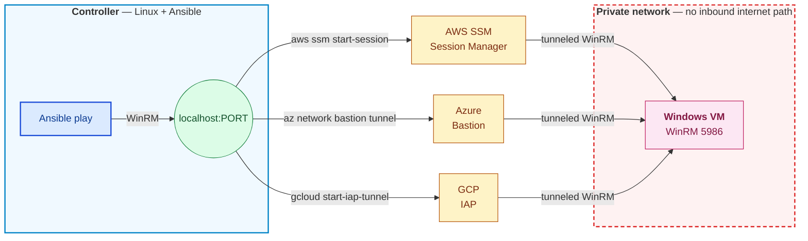

# master_ring.windows_remote

[](https://github.com/caedh121/ansible-master-ring/actions/workflows/ci.yml)
[](LICENSE)
[](https://docs.ansible.com/)

**Manage Windows VMs over WinRM from a Linux Ansible controller across AWS, Azure, and GCP — without a VPN.**

Each cloud already ships an authenticated, audited, identity-based tunnel to
private instances (AWS SSM, Azure Bastion, GCP IAP). This collection wraps
them so a single inventory and play reaches Windows over WinRM through
whichever tunnel the target's cloud provides.

## Architecture



The tunnel role opens a background listener on the controller and rewrites
`ansible_host` / `ansible_port` to `localhost:PORT` so every subsequent task
in the play talks WinRM transparently through the tunnel — no other role
needs to know a tunnel exists.

## Why this exists

Site-to-site VPNs across three clouds are slow, risky, and often not
permitted. Exposing WinRM to the internet is worse. The cloud-native
tunnels are already deployed, already audited, already authenticated with
IAM — this collection puts them behind a single Ansible interface so
`platform: aws` and `platform: gcp` targets look identical to your
playbooks.

## Install

**Option A — Testbox (no local toolchain required).** A disposable Docker
container ships every CLI the collection expects (ansible-core, pywinrm,
AWS CLI v2 + `session-manager-plugin`, Azure CLI, gcloud SDK), installed with
the same version ranges CI uses. Clone the repo, run one script, get an
interactive shell
with the collection already installed:

```bash
git clone https://github.com/caedh121/ansible-master-ring.git
cd ansible-master-ring
docker/run.sh          # Linux/macOS
.\docker\run.cmd       # Windows (Docker Desktop, Linux containers / WSL2)
```

See [`docker/README.md`](docker/README.md) for the full flow, credential
mounts, and troubleshooting.

**Option B — Install into your own controller.** Straight from GitHub:

```bash
ansible-galaxy collection install \
  git+https://github.com/caedh121/ansible-master-ring.git#/ansible/,main
```

Or from Ansible Galaxy (once published):

```bash
ansible-galaxy collection install master_ring.windows_remote
```

## Quick start

```yaml
- hosts: windows_targets
  gather_facts: false
  vars:
    platform: aws
    winrm_via: ssm
  pre_tasks:
    - import_role: { name: master_ring.windows_remote.aws_ssm_tunnel }
    - import_role: { name: master_ring.windows_remote.win_readiness }
  tasks:
    - ansible.windows.win_ping:
  post_tasks:
    - import_role: { name: master_ring.windows_remote.win_reboot }
      when: reboot_needed | default(false)
```

Full Azure and GCP quick starts live in
[`ansible/playbooks/examples/`](ansible/playbooks/examples/).

## Docs

- **Collection README** — [`ansible/README.md`](ansible/README.md) (roles reference, tunnel behavior on reboot, troubleshooting)
- **Per-role docs** — [`ansible/roles/`](ansible/roles/)

## Contact

**Adrian Estrada**
[](mailto:caedh121@gmail.com)
[](https://www.linkedin.com/in/adrian-e-264a6948/)

Feel free to reach out about this
collection, hybrid-cloud Windows automation, or opportunities.

## License

MIT — see [LICENSE](LICENSE).
